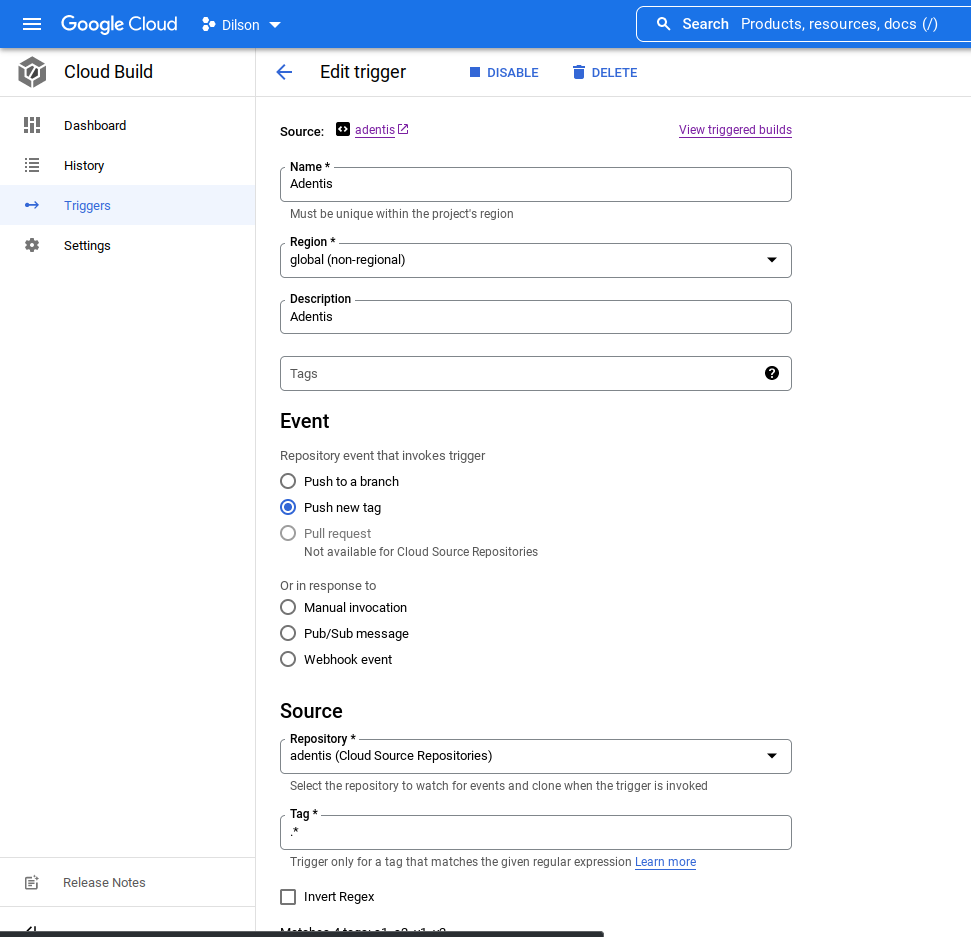

## Hello World Service Kubernetes Deployment
The goal of this exercise is to package a simple Go http service and deploy it on kubernetes using Helm. Considering the following code

```go
package main

import (
        "fmt"
        "net/http"
)

func hello(w http.ResponseWriter, r *http.Request) {
        fmt.Fprintf(w, "Hello\n")
}

func main() {
        http.HandleFunc("/hello", hello)
        http.ListenAndServe(":8090", nil)
}
```

* Create docker image with the code
* Create Helm chart to deploy the docker image
* Define different values for two environments (staging and production)
* Define an auto-scaling policy only for production

>* Consider the need to rollout a newer version to only 10% of users

```go
func​ ​hello​(w http.ResponseWriter, req *http.Request) {
    fmt.​Fprintf​(w, ​"Hello. I’m v2​\n​"​)
```

* Define and implement a strategy

### Bonus feature
Configure HTTPS for the services
### Implementation details
[Google Cloud](https://cloud.google.com/)​ has a free tier that can be used to deploy the result. Version control of the exercise is expected.

---

## Solution

## Used Stack

* [Google Cloud Platform](https://cloud.google.com/)
  * [GKE](https://cloud.google.com/kubernetes-engine)
  * [Cloud build](https://cloud.google.com/build/docs)
  * [Cloud Source Repositories](https://cloud.google.com/source-repositories/docs)
  * [Artifact/Container Registry](https://cloud.google.com/artifact-registry)
  * [SDK Cloud](https://cloud.google.com/sdk)
* [Helm](https://helm.sh/)
* [kubectl](https://kubernetes.io/docs/tasks/tools/#kubectl)
* [Istio](https://istio.io/)
* [CertManager](https://cert-manager.io/)
* [Linux](https://www.linux.org)

Using Google Cloud Platform I created a Kubernetes Cluster using the interface (I prefer work with Terraform but I didn't have much time to create the complete solution).

I created a Cloud Build trigger to build the image pointing to the tag in Git repo that export a docker image to Container Registry.



With Kubernetes deployed We will applying some commands to deploy our application.

First We connect to the cluster using the Google Cloud SDK to configure our `.kube/config`

`gcloud container clusters get-credentials <OUR CLUSTER NAME> --zone <ZONE> --project <OUR PROJECT>`


1. Creating our namespaces Stage and Production (prod) and set Label for Istio

Stage

```Bash
$ kubectl create namespace stage
$ kubectl label namespace stage istio-injection=enabled
```

Prod

```bash
$ kubectl create namespace prod
$ kubectl label namespace prod istio-injection=enabled
```

2. Aplying Istio to cluster

```bash
# Configure the Helm repository
$ helm repo add istio https://istio-release.storage.googleapis.com/charts
$ helm repo update

# Create a namespace istio-system for Istio components
$ kubectl create namespace istio-system

# Install the Istio base chart which contains cluster-wide resources used by the Istio control plane
$ helm install istio-base istio/base -n istio-system

# Install the Istio discovery chart which deploys the istiod service
$ helm install istiod istio/istiod -n istio-system --wait

```

3. Applyng CertManager to get our SSL certificates

```bash
$ kubectl apply -f https://github.com/cert-manager/cert-manager/releases/download/v1.9.0/cert-manager.yaml
```

4. Deployng our application both Stage and Production


Deploy stage environment

>`helm install adentis app-helm-chart -n stage -f app-helm-chart/values-stg.yaml`

Deploy production environment

>`helm install adentis app-helm-chart -n prod -f app-helm-chart/values-prd.yaml`


### Install Cert-Manager for HTTPS prepared for our environments

>`$ kubectl apply -f certs/certificates.yaml`

5. Testing our application

Production

> `for i in {1..10} ;do curl -s https://dilson-adentis.nsupdate.info/hello ; done`
```
Hello
Hello
Hello. I'm v2
Hello
Hello
Hello
Hello
Hello
Hello
Hello
```

Stage

> `for i in {1..10} ;do curl -s https://dilson-adentis-stag.nsupdate.info/hello ; done`
```
Hello
Hello
Hello
Hello
Hello
Hello
Hello
Hello
Hello. I'm v2
Hello
```

References:

* https://helm.sh/docs/topics/charts/
* https://cert-manager.io/docs
* https://cert-manager.io/docs/faq/troubleshooting/#1-checking-the-certificate-resource
* https://istio.io/latest/docs/
* https://cloud.google.com/build/docs